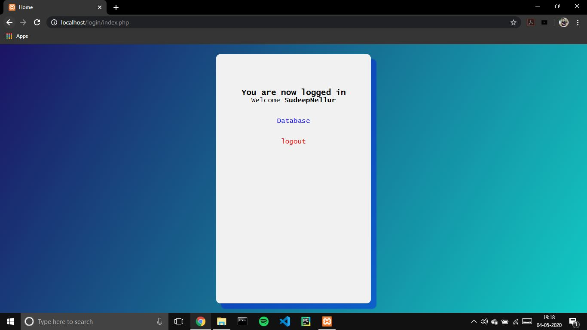
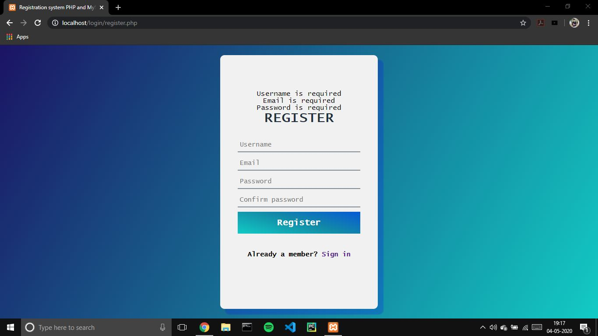
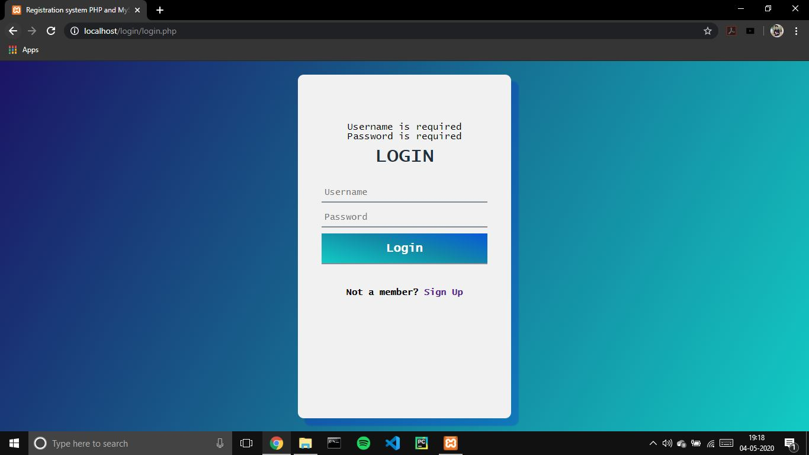
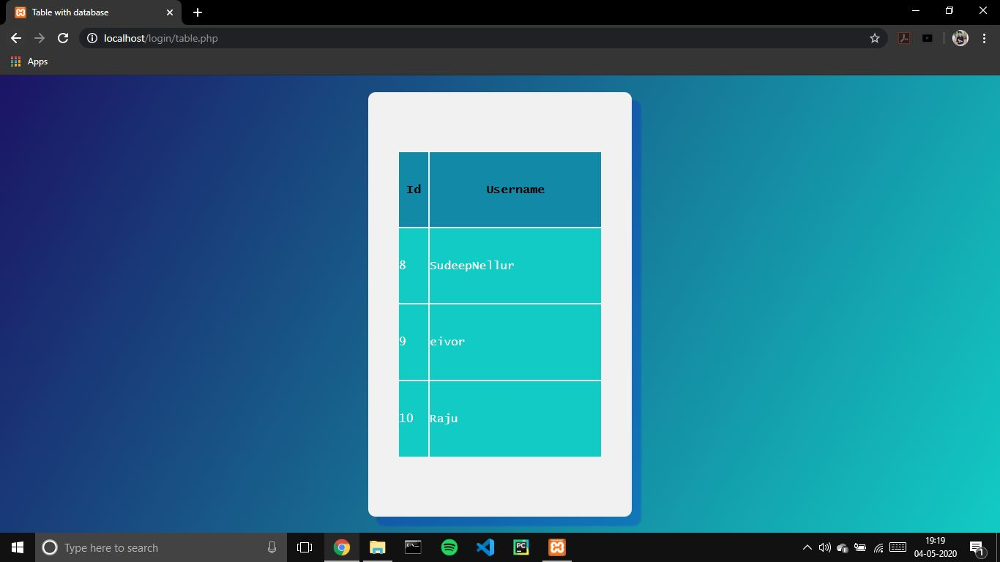

# Registration_Form-php-

It's a basic registration and login form with recorded database.

## Languages Used:
- HMTL(Frontend)
- CSS(UI Design)
- PHP(Backend)

## Features:-
- Index Page with redirecting url for database and logout.

- Register's username validation with existing username.
- Register's email validation with existing email.
- Password re-confirmation while registering.
  

- Login username and password validation.

- Registered user's name display.

